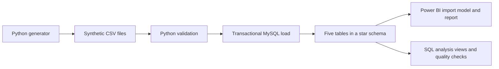

# Manufacturing Logistics Analytics

An independent synthetic manufacturing-logistics portfolio project inspired by my internship learning. It models freight cost and delivery performance for a fictional manufacturer using 2,400 reproducible simulated shipments. This technical extension was independently developed; EY did not commission it. The simulated data and findings do not describe BGL or any client, and contain no confidential operational records.

## What the project answers

- How does recorded freight compare with a modeled baseline?
- Which carriers combine reliable delivery with reasonable shipment cost?
- Which routes and transport modes show higher cost variance or delay rates?
- How do shipment volume and freight costs change over time?

## Architecture



A **star schema** links one shipment table to four descriptive tables for dates, customers, carriers and routes. The report imports these five tables directly; the SQL views support separate analysis. The loader uses **upserts** (insert new records or update existing records with the same key) in a **transaction** (save the entire load together, or undo it if loading/reconciliation fails). It records runs and compares database row counts with the CSV counts before saving. The generated SQL seed is a manual alternative; it retains existing keyed records rather than updating them.

## Technology

- Python 3.10+ standard library for deterministic dataset generation and validation
- MySQL Connector/Python and python-dotenv for configurable database ingestion
- MySQL 8.0.16+ for dimensional modelling, constraints, loading, analytical views and quality checks
- Power BI Desktop project format for the semantic model, DAX measures and report pages

## Repository structure

```text
manufacturing-logistics/
|-- README.md
|-- DATA_DICTIONARY.md
|-- build_dataset.py
|-- requirements.txt
|-- .github/workflows/tests.yml
|-- .vscode/settings.json
|-- tests/
|   |-- test_validation.py
|   `-- check_rollback.py
|-- .env.example
|-- validation_report.json
|-- data/
|   |-- dim_carrier.csv
|   |-- dim_customer.csv
|   |-- dim_date.csv
|   |-- dim_route.csv
|   |-- fact_shipment.csv
|   `-- generation_assumptions.csv
|-- sql/
|   |-- 01_create_schema.sql
|   |-- 02_load_synthetic_data.sql
|   |-- 03_analysis_views.sql
|   `-- 04_quality_checks.sql
|-- src/
|   |-- db_connection.py
|   `-- pipeline.py
`-- powerbi/
    |-- Manufacturing_Logistics_Analytics.pbip
    |-- Manufacturing_Logistics_Analytics.Report/
    |-- Manufacturing_Logistics_Analytics.SemanticModel/
    `-- verify_metrics.sql
```

## Data model

The grain is one completed shipment per `fact_shipment` row. Four dimensions describe dispatch date, customer, carrier and route. Each dimension has a one-to-many relationship with the fact table.

The synthetic dataset contains:

- 2,400 shipments
- 12 fictional customers
- 5 fictional carriers
- 8 fictional routes
- 20 shipment months from January 2025 through August 20, 2026
- INR-denominated recorded freight and modeled baseline components

August 2026 is a partial month and should not be compared with a complete month without stating that limitation.

## Setup and run locally (Windows PowerShell)

Use Python 3.10+ (CI uses 3.14), MySQL 8.0.16+, MySQL Workbench and Power BI Desktop with project-format support. Open the existing `manufacturing-logistics` folder in VS Code and run commands from its root.

1. For a fresh checkout, create the virtual environment and install dependencies. A **virtual environment** keeps this project's Python packages separate. Reuse an existing `.venv` if it is already installed:

   ```powershell
   python -m venv .venv
   .\.venv\Scripts\python.exe -m pip install -r requirements.txt
   ```

   `.vscode/settings.json` points VS Code to this project's `.venv\Scripts\python.exe`. If VS Code has an older interpreter selection saved, use **Python: Select Interpreter** and select that path. The commands here invoke it directly, so PowerShell activation is optional.

2. On a fresh checkout, copy the credential template; keep an existing `.env` intact:

   ```powershell
   Copy-Item .env.example .env
   ```

   Replace the username/password placeholders locally. Defaults are `localhost:3306` and `portfolio_logistics`. The supplied SQL and Power BI model use that database name. Keep credentials in `.env` or Power BI's credential settings, never source files.

3. Validate the committed CSV files without connecting to MySQL:

   ```powershell
   .\.venv\Scripts\python.exe src/pipeline.py --validate-only
   ```

4. Run `sql/01_create_schema.sql` in MySQL Workbench once. It creates the database, five data tables and run-log table. Then load the CSVs:

   ```powershell
   .\.venv\Scripts\python.exe src/pipeline.py
   ```

   Expect 2,400 shipments plus 755 dimension records (3,155 processed rows). A successful run records `SUCCESS` in `pipeline_run_log`; runtime logs go to the Git-ignored `logs/pipeline.log`. Row-count reconciliation expects this fixed dataset in a dedicated local database.

5. Run `sql/03_analysis_views.sql` and `sql/04_quality_checks.sql` in Workbench. The five reported issue counts should be zero. `sql/02_load_synthetic_data.sql` is an alternative manual seed load; it is not required after the Python loader.

6. Follow the connector setup below, open `powerbi/Manufacturing_Logistics_Analytics.pbip`, and refresh. Compare the unfiltered report with `powerbi/verify_metrics.sql`.

The dataset is already committed. Optional regeneration with `.\.venv\Scripts\python.exe build_dataset.py` overwrites the generated CSVs, SQL seed and validation report using fixed seed `20260923`; it is not a setup prerequisite.

## Power BI MySQL connector

Power BI Desktop requires [Oracle MySQL Connector/NET](https://dev.mysql.com/downloads/connector/net/), a driver that lets .NET applications talk to MySQL. The Python package `mysql-connector-python` serves the Python loader and does not meet Power BI's prerequisite. Install Connector/NET before connecting on a new machine, then restart Power BI Desktop. Keep the working Connector/NET installation on the current machine.

In **Windows PowerShell**, verify registration:

```powershell
[System.Data.Common.DbProviderFactories]::GetFactoryClasses() | Out-GridView
```

The dialog should show **MySQL Data Provider**. These requirements and the provider check come from [Microsoft's MySQL connector instructions](https://learn.microsoft.com/en-us/power-query/connectors/mysql-database).

The existing model imports `dim_customer`, `dim_carrier`, `dim_route`, `dim_date` and `fact_shipment` from `localhost` / `portfolio_logistics`. In **File > Options and settings > Data source settings**, choose the MySQL source, edit its permissions, and enter your local MySQL credentials using **Database** authentication. Refresh and clear page filters before comparing cards: expect 2,400 shipments, freight ₹263,524,880.99, baseline ₹234,235,432.40 and 521 delayed shipments. On-time delivery is 78.2917%, displayed as 78% on a whole-percent card. If the host differs, update all five source queries consistently in Power Query. Credentials stay in Power BI's local credential store.

## Tests and GitHub Actions

Run the database-independent tests from the root:

```powershell
.\.venv\Scripts\python.exe -m unittest discover -s tests -p 'test_*.py' -v
```

Six test methods cover valid data, eight invalid shipment cases, non-synthetic dimension markers, malformed CSV headers/rows, a missing column and dataset fingerprints. They use Python's built-in `unittest`; no extra test framework is needed.

`.github/workflows/tests.yml` runs on pushes, pull requests and manual dispatch. It installs the existing Python dependencies, runs `src/pipeline.py --validate-only` and discovers only `test_*.py`. **CI** (continuous integration) means GitHub reruns these checks after a code change. It uses no MySQL service or database secrets, and does not run the database loader.

The separate local **rollback test** checks that an intentional failure undoes an in-progress database change:

```powershell
.\.venv\Scripts\python.exe tests/check_rollback.py
```

Run it only with the local synthetic MySQL database already loaded and `.env` configured. It temporarily changes customer 1 within a transaction and adds a failed run-log entry. It is deliberately named `check_rollback.py` so CI discovery excludes it. It previously passed against local MySQL during development; validation-only and unit-test results do not establish database or Power BI refresh success.

## Three findings from the synthetic data

These are descriptive results from the committed `data/fact_shipment.csv`, using all 2,400 rows without filters. The read-only queries in `powerbi/verify_metrics.sql` reproduce them after loading MySQL.

1. **Freight exceeds the modeled baseline by ₹29,289,448.59 (12.50%).** Recorded freight totals ₹263,524,880.99 against ₹234,235,432.40. The percentage is the difference divided by the total baseline, rather than an average of shipment percentages.
2. **1,879 shipments were on time (78.29%); 521 were delayed (21.71%).** All shipments have both delivery dates. On time means actual delivery on or before the promised date; this explains the rounded 78% delivery card.
3. **Delay rates differ by actual transport mode:** Road 262/1,181 (22.18%), Sea 200/826 (24.21%), and Air 59/393 (15.01%). This describes the simulated mix; it does not establish that choosing air would improve delivery for otherwise identical shipments. The generator allows some planned sea shipments to switch to air, while the promise remains based on the original plan.

## Dashboard pages

1. **Overview:** shipments, freight, modeled baseline, variance, monthly trend, freight per shipment and delivery-date completeness.
2. **Carrier Performance:** delayed shipments, on-time delivery, average delay and carrier cost/service comparison.
3. **Routes and Delays:** route cost variance, recorded delay reasons and delay rate by transport mode.

The report includes year, carrier and transport-mode filters. The filters are local to each page.

## Main metrics

- **Recorded freight:** base freight + fuel surcharge + handling + expedite fee.
- **Modeled baseline:** weight x illustrative planned-mode rate + baseline fuel and handling.
- **Cost variance:** recorded freight - modeled baseline.
- **Freight per shipment:** recorded freight / shipment count.
- **On-time delivery:** actual delivery date on or before promised delivery date.
- **Delay rate:** delayed shipments / shipments with both delivery dates.
- **Average delay:** average calendar-day delay among delayed shipments only.

The modeled baseline is an illustrative planning benchmark. Variance from it does not prove savings, loss, or geopolitical causation.

## Validation

The generator uses fixed seed `20260923` and checks its output. Before loading, the pipeline checks CSV headers/row structure, required values and types, expected table counts, duplicate keys, shipment relationships, finite positive weights, non-negative finite costs, dispatch/delivery ordering, transport modes, flags, delay reasons, baseline/invoice reconciliation and synthetic markers on shipments and descriptive dimensions. `validation_report.json` records generated totals and SHA-256 hashes (file fingerprints) for the CSVs, calculated after normalizing line endings to LF so Windows and Linux checkouts match; it is not evidence of a database execution.

The SQL schema adds primary keys, foreign keys, checks and invoice/baseline reconciliation rules. `04_quality_checks.sql` validates dates, totals, delay reasons and synthetic-data status after loading.

## Current scope

Implemented: deterministic data generation, documented assumptions, CSV extraction and type conversion, pre-load validation, transactional MySQL upserts, rollback, pipeline-run logging, post-load reconciliation, star schema, analytical SQL views, DAX measures and an interactive Power BI report.

The project is designed for a local portfolio environment. It does not include a scheduler, cloud deployment or distributed-processing framework.

## Limitations and repository hygiene

- All costs, rates, customers, carriers and delivery outcomes are generated from illustrative assumptions. Patterns reflect those assumptions and are not observed client performance, audited savings or evidence of geopolitical causes.
- Only completed shipments are modeled. Dispatch dates cover January 2025 through August 20, 2026; August is partial. The 730-day date dimension covers 2025–2026, which does not imply shipment coverage through December 2026.
- The baseline uses the planned mode and fictional rates, not a validated alternative invoice. Carrier/mode comparisons do not control for route, weight, season or expedited service.
- Validation expects a fixed dataset of 2,400 shipments. Post-load reconciliation checks row counts and selected rules; it is not a full field-by-field comparison. It does not turn this local portfolio demonstration into a production system.
- CI checks Python/CSV behavior only. MySQL integration and Power BI refresh require the local applications. No scheduler, cloud deployment or production operations are included.

Git includes only source, synthetic CSVs/SQL, documentation, placeholder `.env.example`, CI, VS Code interpreter settings and the text-based Power BI project. `.env`, virtual environments, logs, caches, binary report exports, `variants/`, the old cleanup guide and the unrelated local dependency snapshot are ignored and retained locally. No confidential client data belongs in this repository.
